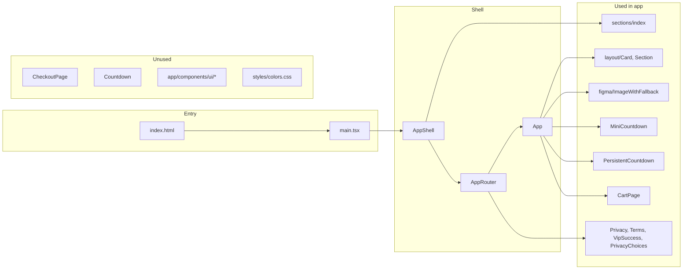

# Unused Files Scan Report

This report categorizes files that appear unused based on import graph from `index.html` → `src/main.tsx` → `AppShell` → `AppRouter` and app code, routing, and config references. **Nothing is deleted or modified.**

---

## 1. Definitely unused

These files are **not imported anywhere** and are **not referenced in routing or config**.

| File | Reason |
| --- | --- |
| [src/app/components/CheckoutPage.tsx](src/app/components/CheckoutPage.tsx) | Never imported. [App.tsx](src/app/App.tsx) uses a Stripe payment link instead (comment: "替代 CheckoutPage" / "replaced by CheckoutPage"). Cart and checkout flow call `goToStripeCheckout()` and never render `CheckoutPage`. |
| [src/app/components/Countdown.tsx](src/app/components/Countdown.tsx) | Never imported. [MiniCountdown.tsx](src/app/components/MiniCountdown.tsx) and [PersistentCountdown.tsx](src/app/components/PersistentCountdown.tsx) implement their own countdown logic and do not use this component. |

---

## 2. Possibly unused

These are **not reached from the app entry or routes** but may be kept intentionally (e.g. shared library, future use).

### 2.1 Entire UI component library — `src/app/components/ui/`

**No file outside `src/app/components/ui/` imports from `@/app/components/ui` or any path under it.** The app uses:

- Layout: [Card](src/app/components/layout/Card.tsx), [Section](src/app/components/layout/Section.tsx) from `@/app/components/layout/`
- Figma: [ImageWithFallback](src/app/components/figma/ImageWithFallback.tsx)
- Countdowns: MiniCountdown, PersistentCountdown
- Pages: CartPage (and routed pages)

So the following are only used **inside** the ui folder (e.g. `utils.ts`, `button.tsx` used by other ui components); they are **unused by the rest of the app**:

- [src/app/components/ui/accordion.tsx](src/app/components/ui/accordion.tsx)
- [src/app/components/ui/alert-dialog.tsx](src/app/components/ui/alert-dialog.tsx)
- [src/app/components/ui/alert.tsx](src/app/components/ui/alert.tsx)
- [src/app/components/ui/aspect-ratio.tsx](src/app/components/ui/aspect-ratio.tsx)
- [src/app/components/ui/avatar.tsx](src/app/components/ui/avatar.tsx)
- [src/app/components/ui/badge.tsx](src/app/components/ui/badge.tsx)
- [src/app/components/ui/breadcrumb.tsx](src/app/components/ui/breadcrumb.tsx)
- [src/app/components/ui/button.tsx](src/app/components/ui/button.tsx)
- [src/app/components/ui/calendar.tsx](src/app/components/ui/calendar.tsx)
- [src/app/components/ui/card.tsx](src/app/components/ui/card.tsx) (distinct from layout/Card.tsx)
- [src/app/components/ui/carousel.tsx](src/app/components/ui/carousel.tsx)
- [src/app/components/ui/chart.tsx](src/app/components/ui/chart.tsx)
- [src/app/components/ui/checkbox.tsx](src/app/components/ui/checkbox.tsx)
- [src/app/components/ui/collapsible.tsx](src/app/components/ui/collapsible.tsx)
- [src/app/components/ui/command.tsx](src/app/components/ui/command.tsx)
- [src/app/components/ui/context-menu.tsx](src/app/components/ui/context-menu.tsx)
- [src/app/components/ui/dialog.tsx](src/app/components/ui/dialog.tsx)
- [src/app/components/ui/drawer.tsx](src/app/components/ui/drawer.tsx)
- [src/app/components/ui/dropdown-menu.tsx](src/app/components/ui/dropdown-menu.tsx)
- [src/app/components/ui/form.tsx](src/app/components/ui/form.tsx)
- [src/app/components/ui/hover-card.tsx](src/app/components/ui/hover-card.tsx)
- [src/app/components/ui/input-otp.tsx](src/app/components/ui/input-otp.tsx)
- [src/app/components/ui/input.tsx](src/app/components/ui/input.tsx)
- [src/app/components/ui/label.tsx](src/app/components/ui/label.tsx)
- [src/app/components/ui/menubar.tsx](src/app/components/ui/menubar.tsx)
- [src/app/components/ui/navigation-menu.tsx](src/app/components/ui/navigation-menu.tsx)
- [src/app/components/ui/pagination.tsx](src/app/components/ui/pagination.tsx)
- [src/app/components/ui/popover.tsx](src/app/components/ui/popover.tsx)
- [src/app/components/ui/progress.tsx](src/app/components/ui/progress.tsx)
- [src/app/components/ui/radio-group.tsx](src/app/components/ui/radio-group.tsx)
- [src/app/components/ui/resizable.tsx](src/app/components/ui/resizable.tsx)
- [src/app/components/ui/scroll-area.tsx](src/app/components/ui/scroll-area.tsx)
- [src/app/components/ui/select.tsx](src/app/components/ui/select.tsx)
- [src/app/components/ui/separator.tsx](src/app/components/ui/separator.tsx)
- [src/app/components/ui/sheet.tsx](src/app/components/ui/sheet.tsx)
- [src/app/components/ui/sidebar.tsx](src/app/components/ui/sidebar.tsx)
- [src/app/components/ui/skeleton.tsx](src/app/components/ui/skeleton.tsx)
- [src/app/components/ui/slider.tsx](src/app/components/ui/slider.tsx)
- [src/app/components/ui/sonner.tsx](src/app/components/ui/sonner.tsx)
- [src/app/components/ui/table.tsx](src/app/components/ui/table.tsx)
- [src/app/components/ui/tabs.tsx](src/app/components/ui/tabs.tsx)
- [src/app/components/ui/textarea.tsx](src/app/components/ui/textarea.tsx)
- [src/app/components/ui/toggle-group.tsx](src/app/components/ui/toggle-group.tsx)
- [src/app/components/ui/toggle.tsx](src/app/components/ui/toggle.tsx)
- [src/app/components/ui/tooltip.tsx](src/app/components/ui/tooltip.tsx)
- [src/app/components/ui/use-mobile.ts](src/app/components/ui/use-mobile.ts)
- [src/app/components/ui/utils.ts](src/app/components/ui/utils.ts)

**Why possibly unused:** They form a self-contained shadcn-style library; only internal references exist. If the app never plans to use these components, the folder is unused from the app's perspective.

### 2.2 CSS not in the bundle

| File | Reason |
| --- | --- |
| [src/styles/colors.css](src/styles/colors.css) | Not imported by [index.css](src/styles/index.css) or any other file. [index.css](src/styles/index.css) only imports `fonts.css`, `tailwind.css`, and `theme.css`. This file defines a separate earth-tone palette (e.g. `--color-primary`) that is never loaded. |

### 2.3 Server-side / non-bundled

| Path | Reason |
| --- | --- |
| [public/api/waitlist.php](public/api/waitlist.php), [public/api/stripe_webhook.php](public/api/stripe_webhook.php), [public/api/_lark.php](public/api/_lark.php), [public/api/config.php](public/api/config.php), [public/api/_mail.php](public/api/_mail.php) | Not part of the Vite bundle (entry is [index.html](index.html) → [src/main.tsx](src/main.tsx)). They are server-side scripts, referenced only if deployed and called by the backend or external services. From the front-end build alone, they are "unused"; they may still be required for API functionality. |

---

## 3. Referenced but missing

| File | Reason |
| --- | --- |
| **src/styles/fonts.css** | [src/styles/index.css](src/styles/index.css) line 1 has `@import './fonts.css';`. The file did not exist in the repo (only `index.css`, `theme.css`, `tailwind.css`, `colors.css` exist under `src/styles/`). This could cause a build warning or failure. A minimal `fonts.css` has been added so the import resolves. |

---

## 4. Generated files / build artifacts

These are produced by the toolchain, not source. They are not referenced in `package.json` scripts as input; they are **output**.

| Path | Reason |
| --- | --- |
| **dist/** | Vite's default output directory (`vite build`). Not in source; created on build. |
| **node_modules/.vite/** | Vite's dependency pre-bundle cache. Generated when running the dev server or build. |

TypeScript is `noEmit: true` in [tsconfig.json](tsconfig.json), so there is no `.tsbuildinfo` or other TS emit to list.

---

## 5. Flow summary

---

## 6. What was not listed as unused

- **src/types/assets.d.ts**, **src/vite-env.d.ts** — Used by TypeScript/Vite (typeRoots and env types).
- **src/constants/images.ts** — Imported by multiple sections; image paths point to `src/assets/` and `src/assets/external/` (asset files themselves are referenced by this module; if `src/assets/` is missing or incomplete, that is a missing-asset issue, not "unused file" in this sense).
- **src/constants/colors.ts**, **src/constants/index.ts** — Used (e.g. PrimaryButton imports `@/constants/colors`).
- **All section components, CookieBanner, TrackingGate, FooterSection, lib/analytics, lib/consent, hooks/useScrollDepth** — In the import graph from main.tsx.
- **package.json scripts** — Only `dev`, `build`, `preview`; no other script files referenced.

No source files were deleted; this is a report only.
